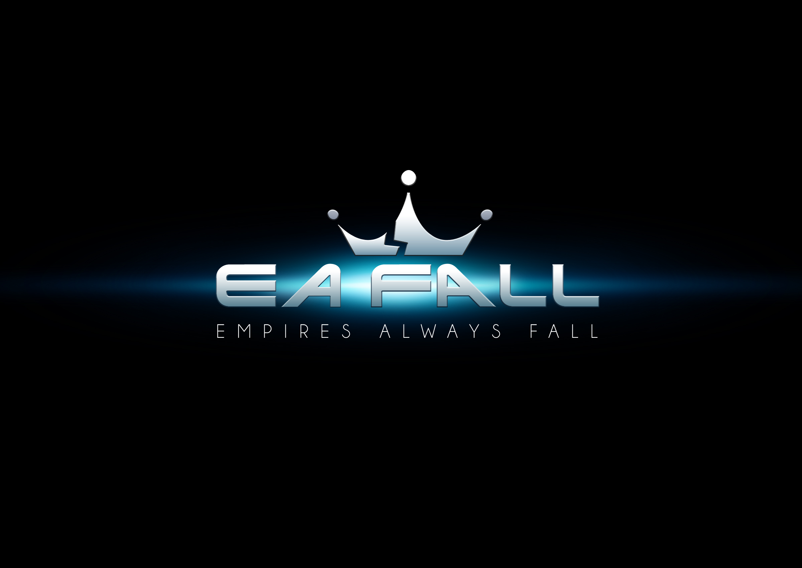

# Імперія Завжди Приречена 

*Читати [English](README.md)*

## Замість вступу

**EAFall** - назва бере свій початок від пісні
[Enter Shikari](https://www.youtube.com/watch?v=TXKPYXIlv54),
і подій 14ого року, коли увага світу була прикута до безпрецедентних дій
одних країн, на території інших.

Ідея ж гри з'явилась одного літнього дня, під час посиденьок у WarCraft на мапі
[enfos](https://www.epicwar.com/maps/188675/).
Звичайно багато чого було змінено під час розробки: орієнтир, баланс, кампанія,
керування і т.п. Великий вплив створила культова сага
[SpaceRangers](https://en.wikipedia.org/wiki/Space_Rangers_(video_game)).

Якщо у вас будуть якісь ідеї стосовно гри, або бажання попрактикуватись у програмуванні, 
чи щось архітектурно змінити - то я буду дуже здивований і можу порадити купу інших проектів більш вартих уваги. 
Якщо ж навіть це вас не зупинить - пишіть на yaroslavlancelot@gmail.com.

Кожен хто пройде гру, може отримати місце у списку 
[першовідкривачів](https://github.com/YaroslavHavrylovych/eafall/blob/develop/finishers_list.md).

## Маленький сюжет

Історія розповідає про далекий світ майбутнього, коли людство, розселене на купи
віддалених планет, починає наймасштабнішу галактичну веремію, що знищує майже половину населення
всесвіту. В такій боротьбі народилася Імперія. Її основа - централізація, 
її мета - пригнічення. І це був лише початок. Експерименти
над людьми, групами людей, містами людей, планетами людей. Всі бунти суворо карались,
кожного їх учасника і весь його рід вирізали під корінь.

Ох, маленький ліричний відступ наслідків людської діяльності. Думаєте люди просто
так почали колонізувати космос? Земля була закинутою вигрібною ямою.
Люди, які там лишились, виживали. Постійні війни за ресурси, голод. 
Це закономірно призвело до повномасштабної ядерної війни. З тих пір на землі лишились
тільки малочислені мутанти, ті хто змогли усе пережити. 
Мало що ми знали про їх історію, доки не побачили, як їх кораблі виходять у відкритий космос. 
Живі кораблі.

І от, в цій бурхливій суміші подій і почались перші паростки повстань. 
Марс. 
Майже всі солдати Імперії на планеті перейшли на бік повстанців. Невелику
групу представників Імперії відправили на перемовини. За пару днів,
коли було роз'яснено всі умови і домовлено про наступні кроки, почалось щось неочікуване.
Всіх перемовників Імперія оголосила вибитими, повстанці не схотіли домовлятись і
планету потрібно знищити, заради миру галактики.

Ідеальний аргумент для початку війни між імперією і марсом. Так, однією планетою на
мірило всесвіту. Але до цього буде пізніше.  Перша кампанія не про це, вона про історії набагато давніші.

Рік 3014. Люди (чи нелюди) на планеті Земля дізнаються, що їх буде атаковано представниками галактики.
Галактика вирішила очистити землю від радіації, від мутантів і зробити її зоною
власної величі. Для цього необхідно лиш зачистити невеличку когорту противників того.

## Цікаві невипадковості

До моменту написання документу (а це орієнтовно два роки),
я забув майже усе, що планував. Але дещиця знань лишилась на поличках пам'яті:

- Всі дати обрані не випадково.
- Всі місії мають назви старих [слов'янкських богів](https://uk.wikipedia.org/wiki/%D0%A1%D0%BF%D0%B8%D1%81%D0%BE%D0%BA_%D1%81%D0%BB%D0%BE%D0%B2%27%D1%8F%D0%BD%D1%81%D1%8C%D0%BA%D0%B8%D1%85_%D0%B1%D0%BE%D0%B3%D1%96%D0%B2).
- EAFall немає нічого спільного з EAGames :) .
- EAFall має щось ідейне від [Enter Shikari](https://uk.wikipedia.org/wiki/Enter_Shikari).
- Планети, крім Землі, є відомими, на час написання, [екзопланетами](https://uk.wikipedia.org/wiki/%D0%95%D0%BA%D0%B7%D0%BE%D0%BF%D0%BB%D0%B0%D0%BD%D0%B5%D1%82%D0%B0). 
- Всі зірки - це сонце під іменами [грецького](https://uk.wikipedia.org/wiki/%D0%93%D0%B5%D0%BB%D1%96%D0%BE%D1%81) бога, чи [японської](https://uk.wikipedia.org/wiki/%D0%90%D0%BC%D0%B0%D1%82%D0%B5%D1%80%D0%B0%D1%81%D1%83) богині.

## Будинки

Нотатки:
* Кожна споруда яка будує кораблі - генерує кисень, 5% від початкової вартості будинку.
* Кожне покращення не включає попередню ціну
(приклад: перший будинок коштує 230, оновлення - 430, отже ціна оновлення 430-230 = 200)

| Будинок | Дія | Ціня | Ефективно проти (за типами атаки) |
| -------- | -------- | ------------ | ---------------- |
| ![Water Cave][water_cave] | Ящірка, Черепаха, Дракон | 270, 330, 430 | Будинки і групи юнітів (гуртова) |
| ![Invisible Plain][invisible_plain] | Скорпіон, Король скорпіонів | 237, 350 | Гуртова атака|
| ![Hydra Pond][hydra_pond] | Молода гідра, Гідра | 400, 445 | Водна печера |
| ![Poison Cave][poison_cave] | Вуж, Кобра | 335, 445 | Павутина, Загата Гідр |
| ![Web][web] | Малий павук, Великий павук | 495, 535 | Гірська печера, Схована місцина |
| ![Mountain Cave][mountain_cave] | Кажан, Вампір | 585, 650 | Отруйна печера, Пекло |
| ![Hell][hell] | Агат, Кек | 665, 745 | Усі крім дорогих |

## Special buildings

| Building | Cost | Special |
| -------- | ---- | ------- |
| ![Bastion][bastion] | 1200 | Будує 3 захисні споруди навколо планети |
| ![Reptile City][reptile_city] | 500 | Перший будино зібльшує дохід на 40%, кожен наступний на 5% |
| ![King of snakes][king_of_snakes] | 500 | Збільшує силу атаки кожного юніта на 40% |

[water_cave]: readme_files/buildings/water_cave.png
[invisible_plain]: readme_files/buildings/invisible_plain.png
[hydra_pond]: readme_files/buildings/hydra_pond.png
[poison_cave]: readme_files/buildings/poison_cave.png
[web]: readme_files/buildings/web.png
[mountain_cave]: readme_files/buildings/mountain_cave.png
[hell]: readme_files/buildings/hell.png
[bastion]: readme_files/buildings/bastion.png
[reptile_city]: readme_files/buildings/reptile_city.png
[king_of_snakes]: readme_files/buildings/king_of_snakes.png

## Кораблі

Кораблів набагато більше ніж будинків і їх потрібно пізнавати через гру.

## Огляд проекту

Є окремий вікі [розділ](https://github.com/YaroslavHavrylovych/eafall/wiki/Project-overview).

## Як зібрати проект?

Теж є окремий вікі [розділ](https://github.com/YaroslavHavrylovych/eafall/wiki/Building-the-project).

## Корисні посилання

[GooglePlay](https://play.google.com/store/apps/details?id=com.yaroslavlancelot.eafall).

Вікі [проекту](https://github.com/YaroslavHavrylovych/eafall/wiki).

*Note* :
Проект побудовано з використанням [AndEngine](https://github.com/nicolasgramlich/AndEngine) graphics, physics.

Список людей, які допомагали у [створенні](https://github.com/YaroslavHavrylovych/eafall/wiki#contributors).

[Ліцензія Apache версія 2 ](license.txt)

---------------------------------------
Ярослав Гаврилович
